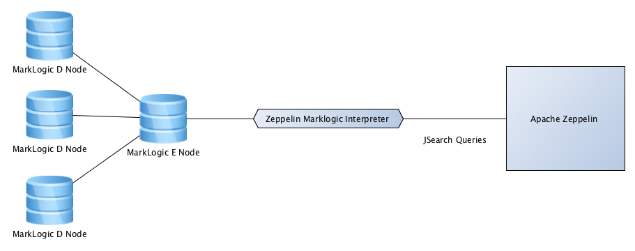
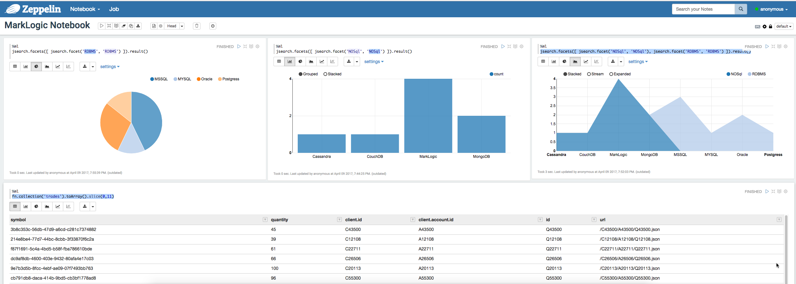

# Apache Zeppelin interpreter for MarkLogic

Apache Zeppelin interpreter for MarkLogic let you execute MarkLogic JSearch queries from Zeppelin notebook against MarkLogic cluster. You can make use MarkLogic distributed computing capabilities and Zeppelin visualization components together.

## What is Apache Zeppelin?
Apache Zeppelin is a web-based notebook that enables interactive data analytics. You can make beautiful data-driven, interactive and collaborative documents with SQL, Scala and more. Fore more details, please refer to Apache Zeppelin [home page](http://zeppelin-project.org/).

## When to use Zeppelin interpreter for MarkLogic?
To execute exploratory queries against MarkLogic and visualize the result in the Apache Zeppelin notebook.

## High Level Architecture



## What is currently supported?
MarkLogic [JSearch](https://docs.marklogic.com/js/jsearch) aggregation/facet, documents and collection queries. I'm in the process of adding the entire JSarch query support. Please stay tuned.

### Example Queries  
```
jsearch.facets([ jsearch.facet('RDBMS', 'RDBMS') ]).result()

jsearch.documents().where(jsearch.byExample({symbol: 'AAPL'})).result().results

fn.collection('trades').toArray()
```
A range index for JSON element 'RDBMS'is expected for the above query. Variable jsearch will be available in the context by default. No need to import '/MarkLogic/jsearch.sjs'.

## How to install Zeppelin interpreter for MarkLogic?

1. Download the latest release from [release folder](https://github.com/sanjuthomas/zeppelin-marklogic-interpreter/tree/master/release). 
2. Unzip the content into zeppelin_home/interpreter. 
3. Edit the zeppelin_home/conf/zeppelin-site.xml file
4. Add "org.sanju.zeppelin.marklogic.interpreter.MarkLogicInterpreter" into the zeppelin.interpreters property value. 
5. Restart Zeppelin.

Above four steps would install the Zeppelin MarkLogic Interpreter. 

## How to create MarkLogic interpreter in Zepplin?

1. Go to Zeppelin home page. (http://host:8080)
2. Click on the username on the right top corner, click on the interpreter. 
3. Click on the Create button on the interpreters page.
4. Select marklogic interpreter group.
5. Given an interpreter name.
6. Leave the connection details as is, or change as per your environment.
7. Save the interpreter.

## How to create a notebook?

1. Click Notebook menu, click Create new note.
2. Select MarkLogic interpreter.
3. Give a name for the notebook. And you are ready to go.


## Zeppelin MarkLogic Notebook Screenshot



## Zeppelin and MarkLogic in action - Video.
[Video](https://youtu.be/ynLRGrRwirc)

## Questions?
Please create an issue in GitHub.


