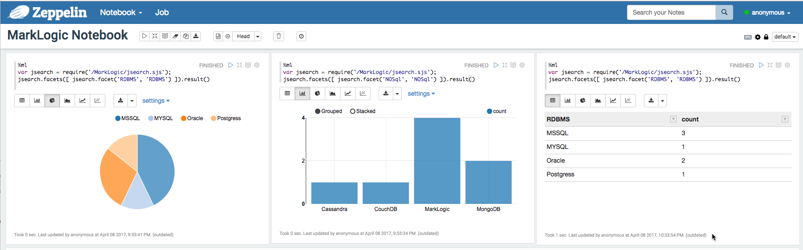

# Apache Zeppelin interpreter for MarkLogic

## Overview
Apache Zeppelin interpreter for MarkLogic, let you fire MarkLogic JSearch queries from Zeppelin notebook against MarkLogic cluster. You can make use MarkLogic distributed computing capabilities and Zeppelin visualization components together.

## What is Apache Zeppelin?

## When to use Zeppelin interpreter for MarkLogic?
To exploratory queries against MarkLogic and visualize the result in the Apache Zeppelin notebook.

## High Level Architecture

## Screenshot

